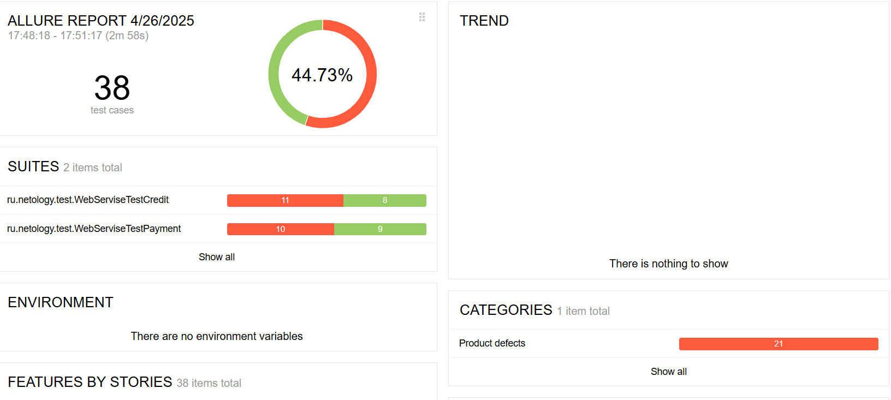
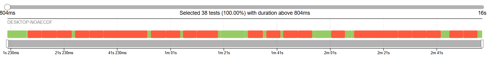
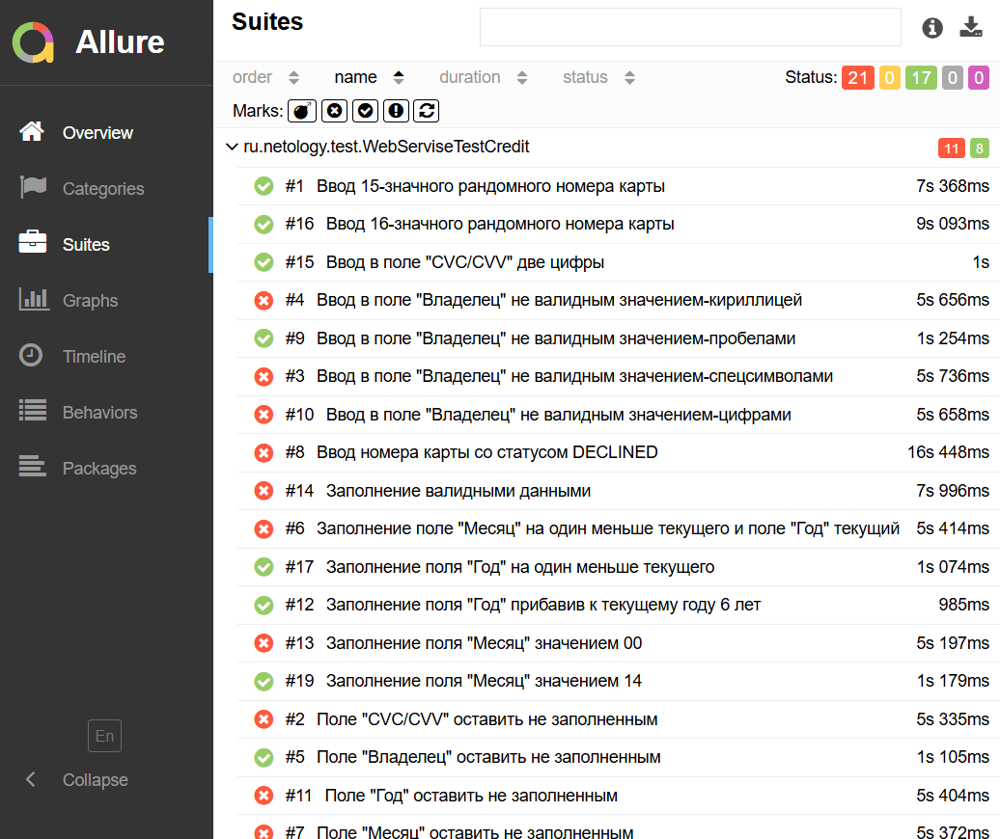

## Краткое описание:
В процессе тестирования реализованы как позитивные, так и негативные сценарии, охватывающие различные аспекты ввода данных для оплаты.
Для тестирования использовались инструменты Selenide и Allure для автоматизации и визуализации результатов.
Тестирование проводилось с использованием базы данных: PostgreSQL.

## Количество тест-кейсов:
Общее количество тест-кейсов составило 38 штуки

## Процент успешных и не успешных тест-кейсов: **
* Процент выполненных тестов 44.73%
* Процент невыполненных тестов 55.27%

## Общие рекомендации:
* Добавить тестовые метки для упрощения написания селекторов при написании автотестов.
* Добавить селекторы для тестирования (типа: data-test-id);
* Устранить баги и провести повторное тестирование.